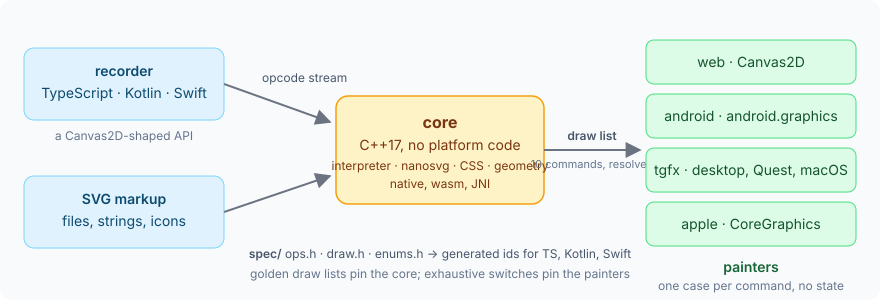
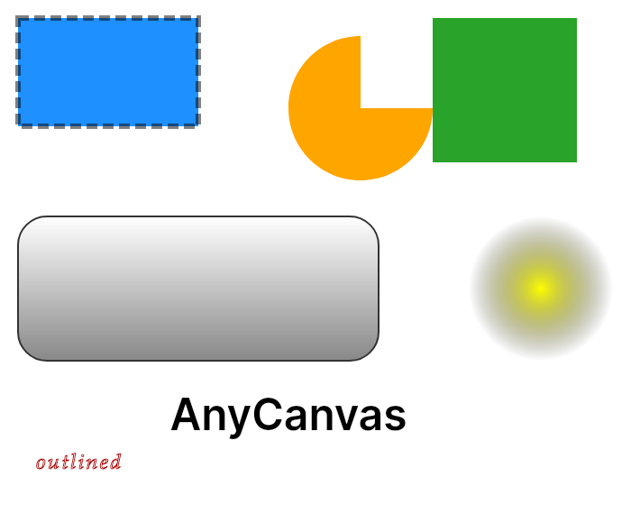
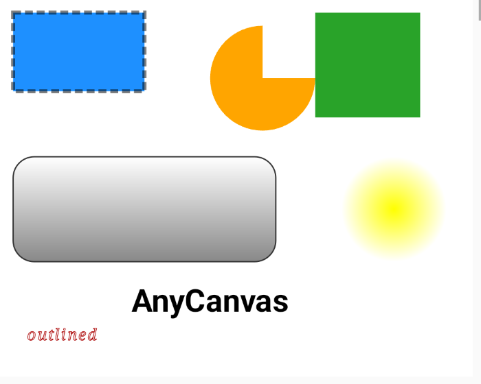
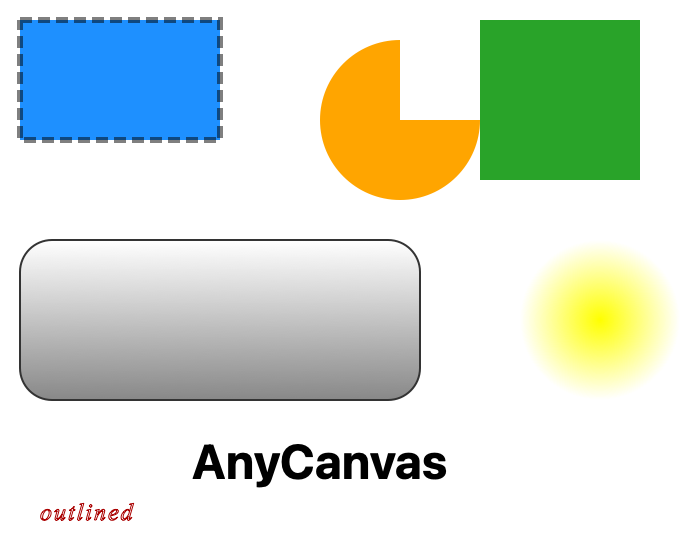
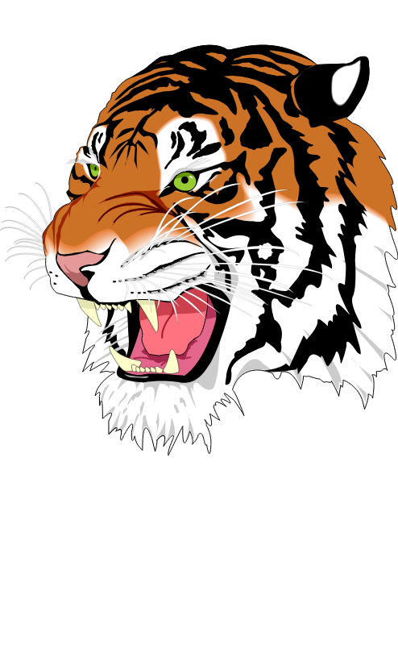
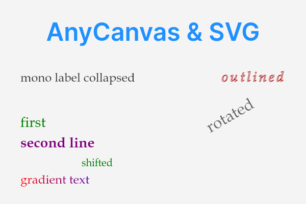

# AnyCanvas

One vector core for canvas drawings and SVG. An app draws through a Canvas2D-shaped API or hands
over SVG markup; a platform-free C++ core turns both into one **draw list**; a thin painter per
platform replays it on the native 2D API. Same list everywhere, native text and pixels everywhere.



The same draw list, painted by Skia on the desktop (left), by `android.graphics` on a phone (middle)
and by CoreGraphics (right):

<p>
  
  
  
</p>

SVG through the same core — nanosvg's shapes and gradients, plus `<text>` drawn with the platform's fonts:

<p>
  
  
</p>

## How it works

| piece | what it is |
|---|---|
| **opcode stream** | what a recorder writes: `Float32Array` + strings, the Canvas2D model (state, transforms, paths, fill / stroke / clip, text, images) plus gradients, dashes, fill rule, letter spacing. Defined in [spec/ops.h](spec/ops.h). |
| **core** | C++17, no platform code: interprets the stream, parses SVG (nanosvg, extended with `<text>`), resolves CSS colors and fonts, turns arcs into cubics, normalizes gradients. C API in [anycanvas.h](core/include/anycanvas/anycanvas.h). Runs native, as wasm, behind JNI. |
| **CSS colors** | ONE parser for canvas styles and SVG: [css_color.h](core/include/anycanvas/css_color.h), header-only C++17 (other engines include it by path, no linking) — hex 3/4/6/8, `rgb()` / `hsl()` in comma or space syntax, the 148 CSS Color 4 names, `transparent`, and `clear` (the one non-CSS alias). Its twins: `parseCssColor` in `anycanvas-recorder` (TypeScript) and the `anycanvas-css-color` crate in [rust/css-color](rust/css-color) (Rust, `no_std`, no dependencies — for build tools that fold color literals at compile time); `tests/golden/colors` holds the three bit-equal. |
| **draw list** | what the core emits: ten commands with everything resolved — absolute transforms, RGBA, `(family size weight italic)`, path verbs, alpha on the paint. Defined in [spec/draw.h](spec/draw.h). |
| **painter** | a loop with one case per command on Canvas2D, `android.graphics`, tgfx or CoreGraphics. Fonts, shaping and image decoding are the platform's, through a few hooks. |

The three headers under `spec/` are the single source of every id: `bun spec/generate.ts` emits
them for TypeScript, Kotlin and Swift, painters switch over them exhaustively, and golden draw lists
pin the core's output. Text is never measured in the core, so goldens are deterministic.

## Use it

```ts
// TypeScript: record, then paint what the core returned (browser, OffscreenCanvas, node-canvas)
const c = new Recorder()
c.fillStyle = "#1e90ff"; c.roundRect(10, 10, 200, 80, 16).fill()
c.font = "bold 24px Inter"; c.fillText("hello", 20, 60)
const { cmd, refs } = c.stream()                 // → the core (native or wasm)
paint(ctx, readDrawList(words, strings), { image: id => surfaces[id] })
```

```kotlin
// Android
val list = AnyCanvas().interpret(cmd, refs, scale = density)
Painter(hooks).paint(Canvas(bitmap), list)
core.parseSvg(markup)?.use { painter.paint(canvas, it.draw(w, h, tint = Color.RED)) }
```

```c
/* C: the host keeps the pixels; the core keeps the format */
ac_interpret(ctx, cmd, len, refs, nrefs, scale, &list);   /* then replay `list` with your painter */
ac_svg_draw(ctx, svg, w, h, 1, tint, &list);
ac_encode(rgba, w, h, 0 /* png */, 100, &bytes);
```

## Layout

```
spec/              ops.h · draw.h · enums.h, generate.ts → gen/ (TS, Kotlin, Swift)
core/              the library (C API + C++ internals), vendor/ nanosvg + stb
recorders/ts/      Recorder (npm anycanvas-recorder)
rust/css-color/    the Rust twin of css_color.h (crate anycanvas-css-color; cargo test = the color golden)
painters/web/      reader + Canvas2D painter (npm anycanvas-web)
painters/android/  Kotlin painter + JNI binding, a Gradle library; demo/ = the on-device check app
painters/tgfx/     C++ painter sources, compiled by the including build
painters/apple/    Swift painter over CoreGraphics + CoreText and the Swift binding (SwiftPM, the manifest at the
                   repo root: products AnyCanvasPainter / AnyCanvas, acpaint); demo/ = the on-device check app
tools/acdump       draw lists and reference PNGs from the command line
tests/             ctest (unit + css_color + golden), bun (recorder, reader, painter, color twin), cargo (color twin),
                   golden/ (the corpus; golden/colors: the color corpus + the C++ parser's answers)
docs/images/       this README's pictures; `bun tests/ts/readme-images.ts` regenerates them from the goldens
```

## Build and test

```
./build.ps1  |  ./build.sh          core + tools + ctest (MSVC / clang / gcc, Ninja)
bun install && bun test tests/ts    recorder, reader, web painter on Skia
./build.ps1 -Update                 rewrite the goldens after an intended change — review the diff
painters/android: ./gradlew :anycanvas:assembleRelease · :demo:assembleDebug (16 goldens on the phone)
swift test                          reader, core goldens, painter pixels on the Mac (CoreGraphics is the same API there)
xcodebuild test -scheme AnyCanvas-Package -destination 'platform=iOS Simulator,name=iPhone 17'
swift run acpaint list.bin out.png  a draw list or SVG painted by CoreGraphics
build/acdump svg file.svg           the draw list of an SVG; `png file.svg out.png` = a CPU reference raster
```

Goldens are byte-equal on the platform that wrote them and numerically equal (±1e-4) elsewhere:
float trig differs in the last digits between libms.

## Limits

- Text is drawn by the platform: identical draw lists, different pixels.
- Canvas2D gradients only pad; Android's radial gradient is concentric (no focal point);
  `letterSpacing` on the web needs Chrome 99+ / Safari 17+. Gradient stops with alpha 0 take their
  neighbour's RGB in the core, so straight-alpha interpolators (Skia, tgfx) fade like the browser's
  premultiplied one; stops with partial alpha still differ slightly between the two.
- SVG is nanosvg's model plus text: shapes, gradients, dashes, transforms, opacity, a tint override,
  `<text>` / `<tspan>` with anchor, baseline and letter-spacing. A `<tspan>` without a position
  merges into its run (no metrics in the core). No `textPath`, filters, masks, patterns or CSS
  beyond class selectors.
- SVG colors use the canvas grammar (a color's own alpha times the `*-opacity`); an invalid color
  ignores the declaration, as in a browser; `currentColor` is not supported (the inherited paint
  stays).

## Status

Built and tested: spec + generator, core, TS recorder and painter, Android painter + JNI (AAR, checked
on a phone), SVG text, the Apple painter + binding (SwiftPM; 48 tests on the Mac and the iPhone
simulator, the cross-painter reference against nanosvgrast). Written, compiled by its host build: the
tgfx painter. Not started: the Kotlin and Swift recorders.

MIT. nanosvg is zlib, stb_image_write public domain.
